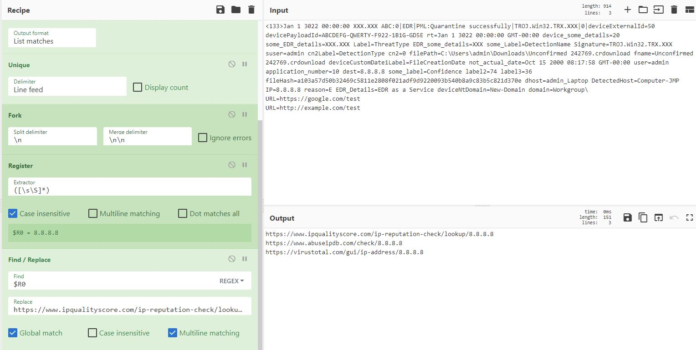

# CyberChef Recipes

Here are the list of Recipes I have created in the past.

# Semi Automate IOC Enrichment

OSINT IOC Enrichment is often a built-in tool for Commercial Security Devices, sometimes free or a paid add-on. Recipes below aim to reduce manual task of copy and pasting IOC to OSINT websites. If you have a commercial/internal tool that accepts GET request as an input for IOC, you can modify Find/Replace Operation below to your internal tool to perform the request.

## DNS Resolution (by Jon Glass but modified)

Utilizes DNS over HTTP capability of CyberChef to query A record of any domain. I have adjusted this since Regex is not working on Jon's presentation.
https://www.youtube.com/watch?v=sPIyrOPLHlY
https://www.osdfcon.org/presentations/2019/Jonathan-Glass_Cybersecurity-Zero-to-Hero-With-CyberChef.pdf

### Recipe Details

```[{"op":"Fork","args":["\\n","\\n\\n",false]},{"op":"DNS over HTTPS","args":["https://dns.google.com/resolve","A",false,false]},{"op":"JPath expression","args":["Answer[0]","\\n"]},{"op":"Regular expression","args":["User defined","\\{\\\"name\\\"\\:\\\"(.*)\\.\",.*data\\\"\\:\\\"(.*)\"\\}",true,true,false,false,false,false,"List capture groups"]}]```


## URL OSINT

Parses URLs from raw/SIEM/alert logs then creates HTTP request string going to OSINT for those URLs ready to be open in new tab.

### Recipe Details

```[{"op":"Regular expression","args":["User defined","([A-Za-z]+://)([-\\w]+(?:\\.\\w[-\\w]*)+)(:\\d+)?(/[^.!,?\"<>\\[\\]{}\\s\\x7F-\\xFF]*(?:[.!,?]+[^.!,?\"<>\\[\\]{}\\s\\x7F-\\xFF]+)*)?",true,true,false,false,false,false,"List matches"]},{"op":"Fork","args":["\\n","\\n\\n",false]},{"op":"URL Encode","args":[true]},{"op":"Register","args":["([\\s\\S]*)",true,false,false]},{"op":"Find / Replace","args":[{"option":"Regex","string":"$R0"},"https://www.virustotal.com/gui/search/$R0\\nhttps://whois.domaintools.com/$R0\\nhttps://transparencyreport.google.com/safe-browsing/search?url=$R0\\nhttps://urlvoid.com/scan/$R0\\nhttps://sitecheck.sucuri.net/results/$R0\\nhttps://fortiguard.com/webfilter?q=$R0&version=9",true,false,true,false]},{"op":"Subsection","args":["https://www.virustotal.com/gui/search/(.*?)\\n",true,true,false]},{"op":"URL Encode","args":[true]},{"op":"Merge","args":[true]},{"op":"Subsection","args":["https://urlvoid.com/scan/(.*?)\\n",true,true,false]},{"op":"URL Decode","args":[]},{"op":"Find / Replace","args":[{"option":"Regex","string":"https://"},"",true,false,true,false]},{"op":"Merge","args":[true]},{"op":"Subsection","args":["https://sitecheck.sucuri.net/results/(.*?)\\n",true,true,false]},{"op":"URL Decode","args":[]},{"op":"Find / Replace","args":[{"option":"Regex","string":"https://"},"",true,false,true,false]},{"op":"Merge","args":[true]},{"op":"Find / Replace","args":[{"option":"Regex","string":""},"",true,false,true,false]}]```


## IP OSINT

Parses IPs from raw/SIEM/alert logs then creates HTTP request string going to OSINT for those IPs ready to be open in new tab.

### Recipe Details

```[{"op":"Regular expression","args":["IPv4 address","(?:(?:\\d|[01]?\\d\\d|2[0-4]\\d|25[0-5])\\.){3}(?:25[0-5]|2[0-4]\\d|[01]?\\d\\d|\\d)(?:\\/\\d{1,2})?",true,true,false,false,false,false,"List matches"]},{"op":"Unique","args":["Line feed",false]},{"op":"Fork","args":["\\n","\\n\\n",false]},{"op":"Register","args":["([\\s\\S]*)",true,false,false]},{"op":"Find / Replace","args":[{"option":"Regex","string":"$R0"},"https://www.ipqualityscore.com/ip-reputation-check/lookup/$R0\\nhttps://www.abuseipdb.com/check/$R0\\nhttps://virustotal.com/gui/ip-address/$R0",true,false,true,false]}]```



## SHA256 OSINT

Parses SHA256 hashes from raw/SIEM/alert logs then creates HTTP request string going to OSINT for those hashes ready to be open in new tab.

### Recipe Details

```[{"op":"Regular expression","args":["User defined","[A-Fa-f0-9]{64}",true,true,false,false,false,false,"List matches"]},{"op":"Register","args":["([\\s\\S]*)",true,true,false]},{"op":"Find / Replace","args":[{"option":"Regex","string":"$R0"},"https://www.virustotal.com/gui/file/$R0\\nhttps://www.talosintelligence.com/talos_file_reputation?s=$R0\\nhttps://www.hybrid-analysis.com/search?query=$R0",true,false,true,false]}]```


